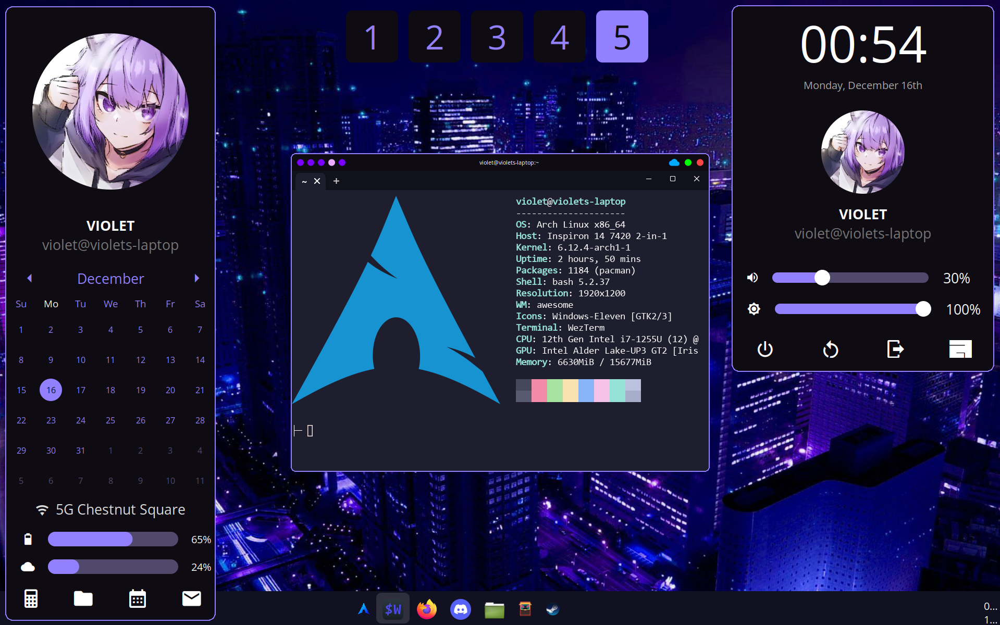

# AwesomeWM Configuration

My configuration for AwesomeWM.



This configuration is *not* designed to be hyper-extensible or to meet everyone's needs. It's my *personal* configuration.

## Prerequisites

This configuration is designed only to work on Arch Linux. It may work on others, but there's no guarantee.

As of the time writing this, you need to use the `awesome-git` package, *not* the regular `awesome` package. It contains newer features that this configuration relies on.

### Quick Install

```bash
sudo pacman -S picom flameshot feh xorg-xinput brightnessctl pamixer ffmpeg wezterm firefox nemo discord neovim 
git clone https://github.com/vi013t/dotfiles.git
cp -r ./dotfiles/.config/awesome ~/.config/awesome
```

### Manual Install

This configuration requires the following programs to be installed:

- [picom](https://github.com/yshui/picom) - For compositing
- [flameshot](https://flameshot.org/) -- For screenshotting
- [feh](https://feh.finalrewind.org/) - For applying wallpapers
- [xinput](https://wiki.archlinux.org/title/Xinput) - For enabling touchpad support
- [brightnessctl](https://github.com/Hummer12007/brightnessctl) - For changing brightness
- [pamixer](https://github.com/cdemoulins/pamixer) - For changing volume
- [ffmpeg](https://www.ffmpeg.org/) - For playing sounds (such as when adjusting volume)

On Arch, you can install them like so:

```bash
sudo pacman -S picom flameshot feh xorg-xinput brightnessctl pamixer ffmpeg
```

The default programs that the configuration will try to use are as follows, which are also required unless you plan to change them:

- [WezTerm](https://wezfurlong.org/wezterm/index.html) - Terminal
- [Firefox](https://www.mozilla.org/en-US/firefox/) - Browser
- [Nemo](https://github.com/linuxmint/nemo) - File Explorer
- [Discord](https://discord.com/) - Chat
- [Neovim](https://neovim.io/) - Editor
- [Silico Calculator](https://github.com/silico-apps/calculator) - Calculator

On Arch, you can install them as well:

```bash
sudo pacman -S wezterm firefox nemo discord neovim
cargo install silico-calculator
```

## Usage

### Keybindings

Below are some common keybindings. For a full list of keybindings, see [`preferences.lua`](https://github.com/vi013t/dotfiles/tree/main/.config/awesome/preferences.lua).

- Widgets
    - `Windows` - Open start menu
    - ``Windows + ` `` - Open sidebar
    - `Windows + [1-5]` - View tag
- Applications
    - `Windows + Enter` - Terminal (WezTerm by default)
    - `Windows + Shift + F` - Browser (Firefox by default)
    - `Windows + Shift + E` - File Explorer (Nemo by default)
    - `Windows + Shift + D` - Chat (Discord by default)
    - `Windows + Shift + S` - Screenshot (Flameshot by default)

## Customization

All assets used by this configuration are stored in `/assets`. Replace the ones of your choosing to customize.

Also see [`preferences.lua`](https://github.com/vi013t/tree/main/preferences.lua) for changing pinned applications, preferred applications, keybindings, etc.
