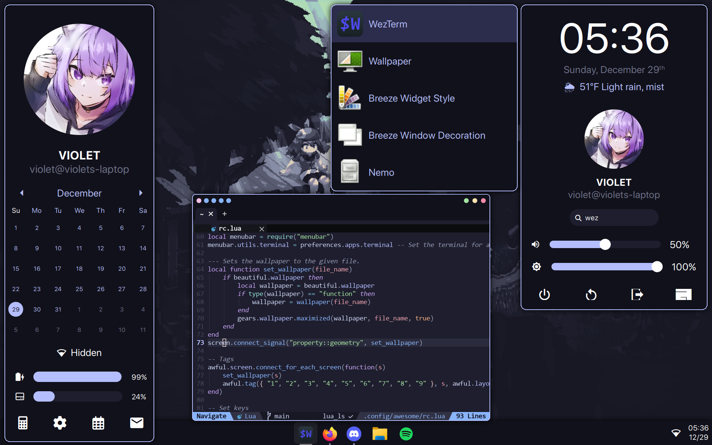

My dotfiles, including configuration for:

- [AwesomeWM](https://awesomewm.org/)
- [Cfg](https://github.com/vi013t/cfg)
- [Darling](https://github.com/darling-package-manager/darling)
- [Joshuto](https://github.com/kamiyaa/joshuto)
- [Neovim](https://neovim.io/)
- [OneDrive](https://abraunegg.github.io/)
- [Picom](https://github.com/yshui/picom)
- [VSCodium](https://vscodium.com/)
- [Wezterm](https://wezfurlong.org/wezterm/index.html)
```
