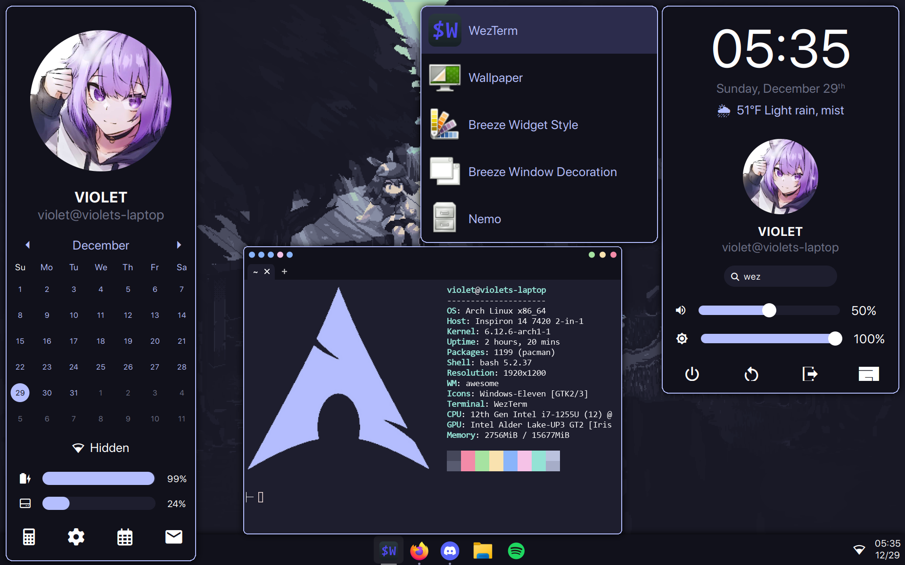

# AwesomeWM Configuration

My configuration for AwesomeWM. 



This configuration is *not* designed to be hyper-extensible or to meet everyone's needs. It's my *personal* configuration. That being said, there is a fair bit of customization supported.

## Installation

Below are instructions for installing this configuration on your own machine.

### Prerequisites

This configuration is designed only to work on Arch Linux. It may work on others, but there's no guarantee. Furthermore, this configuration has been designed to work on a single-screened 1080p laptop. Other hardware, such as 4k screens, multi-monitor setups, wired devices without battery or brightness control, etc., may not work with this configuration. Use at your own discretion. 

As of the time writing this, you need to use the `awesome-git` package, *not* the regular `awesome` package. It contains newer features that this configuration relies on.

### Quick Install

On Arch, you can install with one command by downloading and running the install script, *assuming you already have `awesome-git` installed and startable*:

```bash
eval "$(curl https://raw.githubusercontent.com/vi013t/dotfiles/refs/heads/main/.config/awesome/install.sh)"
```

This will install all the required and default packages for this configuration.

You may also want to check out [my picom config](https://github.com/vi013t/dotfiles/tree/main/.config/picom/picom.conf), which sets up window shadows, vsync, etc.

Check out [the usage section](https://github.com/vi013t/dotfiles/tree/main/.config/awesome#usage) for information on how to use this configuration.

### Manual Install

If you prefer a more fine-tuned installation, you can install the prerequisites manually. For example, you may not need certain packages; i.e., if you're not on a laptop, you may not require brightness control. Read on for specifics about the used packages and what they do.

This configuration requires the following programs to be installed:

- [coreutils](https://www.gnu.org/software/coreutils/) - For various required utilities 
- [fontconfig](https://www.freedesktop.org/wiki/Software/fontconfig/) - For font installation
- [wireless_tools](https://hewlettpackard.github.io/wireless-tools/Tools.html) - For fetching wifi information
- [picom](https://github.com/yshui/picom) - For compositing
- [feh](https://feh.finalrewind.org/) - For applying wallpapers
- [xinput](https://wiki.archlinux.org/title/Xinput) - For enabling touchpad support
- [brightnessctl](https://github.com/Hummer12007/brightnessctl) - For changing brightness
- [pamixer](https://github.com/cdemoulins/pamixer) - For changing volume
- [ffmpeg](https://www.ffmpeg.org/) - For playing sounds (such as the ping when adjusting volume)
- [ripgrep](https://github.com/BurntSushi/ripgrep) - For locating program files

On Arch, you can install them like so:

```bash
sudo pacman -S coreutils fontconfig wireless_tools picom feh xorg-xinput brightnessctl pamixer ffmpeg ripgrep
```

This configuration also requires Rust. If you don't have it installed, install it:

```bash
sudo pacman -S rustup
. "$HOME/.cargo/env"
rustup default stable
```

The default programs that the configuration will try to use are as follows, which are also required unless you plan to change them:

- [WezTerm](https://wezfurlong.org/wezterm/index.html) - Terminal
- [Firefox](https://www.mozilla.org/en-US/firefox/) - Browser
- [Nemo](https://github.com/linuxmint/nemo) - File Explorer
- [Discord](https://discord.com/) - Chat
- [Neovim](https://neovim.io/) - Editor
- [Spotify](https://open.spotify.com/) - Music Player
- [Silico Calculator](https://github.com/silico-apps/calculator) - Calculator
- [flameshot](https://flameshot.org/) - For screenshotting

On Arch, you can install them as well:

```bash
sudo pacman -S wezterm firefox nemo discord neovim spotify-launcher flameshot
cargo install silico-calculator
```

If you have an existing Awesome configuration, move it elsewhere:

```bash
mv ~/.config/awesome ~/.config/awesome_old
```

Then, just clone and copy the config over:

```bash
git clone https://github.com/vi013t/dotfiles.git
mv ./dotfiles/.config/awesome ~/.config/awesome
```

If you want to use the Picom configuration as well for window shadows and whatnot, do the same for Picom:

```bash
mv ~/.config/picom ~/.config/picom_old # If you already have a picom config
mv ./dotfiles/.config/picom ~/.config/picom
```

That's it! Feel free to delete the rest of the dotfiles for cleanup:

```bash
rm ./dotfiles -rf   
```

Just load/reload AwesomeWM for the config to take effect.

## Usage

This config is designed to be both efficient and easy to use, with some minimal but helpful keybinings.

### Keybindings

Below are some common keybindings. For a full list of keybindings, see [`preferences.lua`](https://github.com/vi013t/dotfiles/tree/main/.config/awesome/preferences.lua).

- Widgets
    - `Windows` - Open start menu
    - ``Windows + ` `` - Open sidebar
    - `Windows + [1-5]` - View tag
- Applications
    - `Windows + Enter` - Terminal (WezTerm by default)
    - `Windows + Shift + F` - Browser (Firefox by default)
    - `Windows + Shift + E` - File Explorer (Nemo by default)
    - `Windows + Shift + D` - Chat (Discord by default)
    - `Windows + Shift + S` - Screenshot (Flameshot by default)
- Other Functionality
    - `Windows + Tab` - Switch bentween open applications
    - `Windows + R` - Reload Awesome

## Customization

All assets used by this configuration are stored in `/assets`. Replace the ones of your choosing to customize.

Also see [`preferences.lua`](https://github.com/vi013t/dotfiles/tree/main/.config/awesome/preferences.lua) for changing pinned applications, preferred applications, keybindings, etc.
